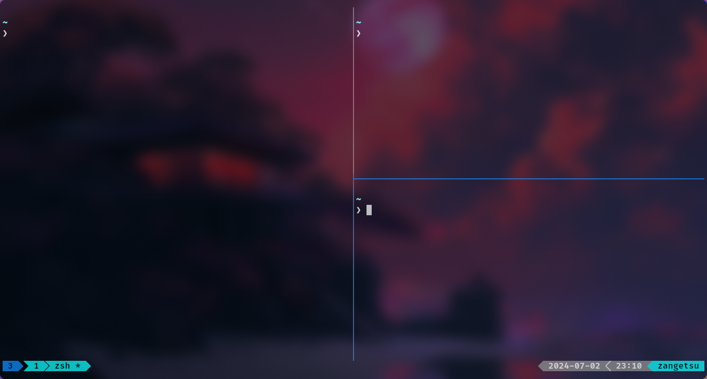
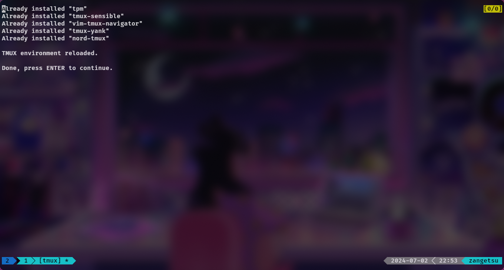

# CustomTerminal-Tmux

## What We're Going to Achieve 🚀
[](https://www.youtube.com/watch?v=7poUgkPtEA8)

## Tmux - 
Tmux is a terminal multiplexer that allows you to use the terminal in a tiled format. It also creates sessions that can be switched using prefix commands: `prefix + n` for next and `prefix + p` for previous.

## Installation 📦

### Ubuntu
Make sure the repositories are up to date and then install Tmux:
```sh
sudo apt update
sudo apt install tmux
```

### macOS
#### Step 1: Install Homebrew (if not already installed)
```sh
/usr/bin/ruby -e "$(curl -fsSL https://raw.githubusercontent.com/Homebrew/install/master/install)"
```
#### Step 2: Install Tmux
```sh
brew install tmux
```

## Tmux Package Manager
We'll be using TPM (Tmux Plugin Manager) for our configuration process.

### Requirements
- `tmux`
- `git`
- `bash`

### Clone TPM
```sh
git clone https://github.com/tmux-plugins/tpm ~/.tmux/plugins/tpm
```

### Dot-file
Create a configuration file:
```sh
touch ~/.tmux.conf

# OR

touch $XDG_CONFIG_HOME/tmux/tmux.conf
```
All of our configurations will go in this file. Let's start with a simple example:
```sh
set -g mouse on
```
Save the file and then run the following command in the Tmux terminal:
```sh
tmux source ~/.config/tmux/tmux.conf
```

## Prefix Key
All Tmux shortcuts use the prefix key `Ctrl + b`. We'll change it to a more comfortable key combination.

## Splitting the Terminal 🖥️
You can tile panes and adjust their sizes using:
```sh
Ctrl + b <Arrow Key>
```
> **Note:** Keep pressing the prefix key until you get the desired size.

### Horizontal Split
```sh
Ctrl + b "
```

### Vertical Split
```sh
Ctrl + b %
```
> **Note:** Use the shift key for `"` and `%`.

## Setting Up Configurations ⚙️

### Changing the Prefix Key
We'll change the prefix key to `Ctrl + Space`. You can use whatever key combination suits you best:
```sh
unbind C-b
set -g prefix C-Space
bind C-Space send-prefix
```

### TPM Configuration
Add the following to your `tmux.conf`:
```sh
set -g @plugin 'tmux-plugins/tpm'
set -g @plugin 'tmux-plugins/tmux-sensible'

run '~/.tmux/plugins/tpm/tpm'
```
> **Note:** This should be at the bottom of your `tmux.conf` file.

Then, install TPM in Tmux:
```sh
Ctrl + b + Shift + i
```
You should see something like this:


### Theming 🎨
We'll use the Nord theme. Add this to your `tmux.conf`:
```sh
set -g @plugin "arcticicestudio/nord-tmux"
```

### Navigator
We'll use `christoomey/vim-tmux-navigator` to boost productivity, as it integrates with Vim and Neovim:
```sh
set -g @plugin 'christoomey/vim-tmux-navigator'
```
Key bindings:
```sh
bind h select-pane -L
bind j select-pane -D 
bind k select-pane -U
bind l select-pane -R
```